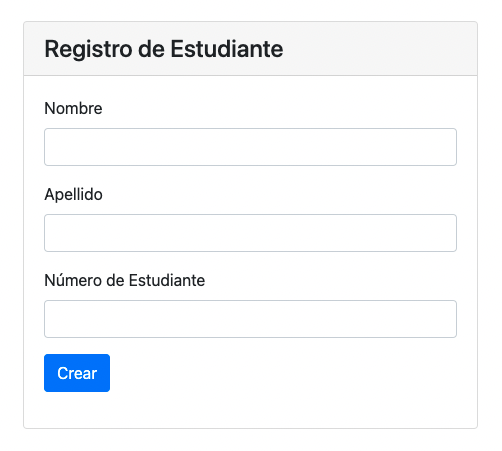

# Ejemplo de Registro de Estudiante
Rest Api en .net 3.1 + Frontend en Angular

## Estructura del repo
- backend/registro-estudante - Directorio conteniendo la solución de la API Rest para registrar estudiantes
	- registro-estudiante.sln solución de ejemplo de Estudiante
	- registro-estudiante - Proyecto Api

- frontend/registro-estudiante-app - Directorio conteniendo la aplicación web para crear nuevos estudiantes

- assets - Imágenes para readme

## REST Api

- GET http://localhost:5000/api/estudiante - retorna todos los estudiantes que fueron creados en memoria
- GET http://localhost:5000/api/estudiante/[id] - retorna los datos de un estudiante con id = [id]

- POST http://localhost:5000/api/estudiante - crear nuevo estudiante, ej. para body:
  
  ```
  {
   "Nombre":"Carlos",
   "Apellido":"López",
   "NroEstudiante":123456
  }
  ```
 - PUT http://localhost:5000/api/estudiante - editar un estudiante ya existente, ej. para body:
  
    ```
    {
     "Id":1,
     "Nombre":"Carlos",
     "Apellido":"López",
     "NroEstudiante":1234567
    }
    ```
  - DELETE http://localhost:5000/api/estudiante/[id] - elimina el estudiante con id = [id]

## Frontend

